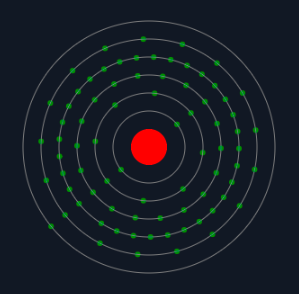
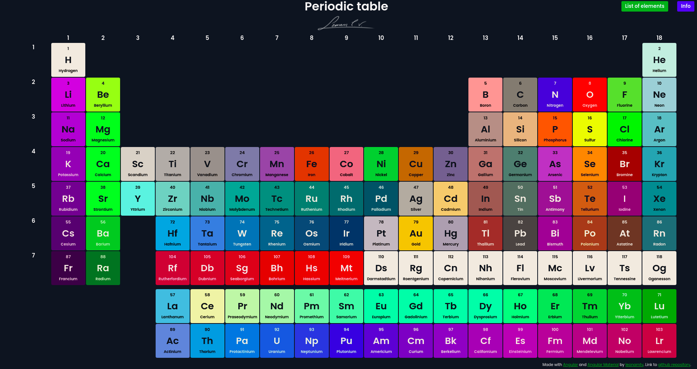
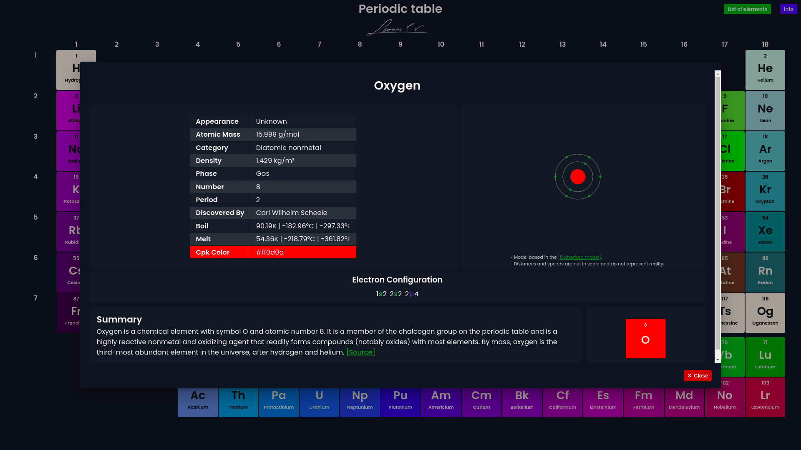
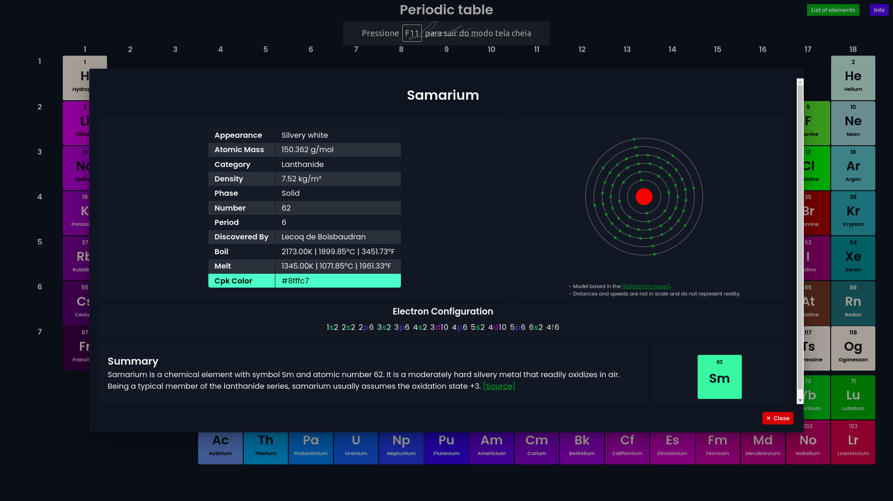
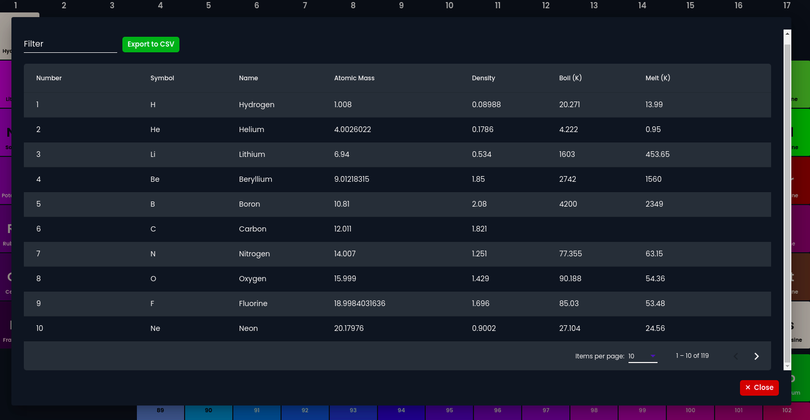

# Periodic Table

    

This project designs a periodic table using the data from <a target=”_blank” href="https://github.com/Bowserinator/Periodic-Table-JSON">Bowserinator's github repository</a>. The table looks like this:

    

## Usage

* You can click in the element to see more information about it. 

  

* You can also navigate straight to a specific element by typing its symbol or name in the address bar like this: 
  * `https://leonamtv.github.io/periodic-table/#/sm` or 
  * `https://leonamtv.github.io/periodic-table/#/samarium`

    

Make sure to type <b>/#/</b> before the name or symbol.
* If you click in the <b>List of elements</b> you can have the elements in the form of a table.   

    

* You can sort any of the columns and export to <b>.csv</b>  

  

